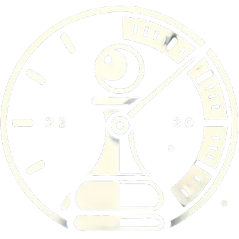

# ChessTicks ⏱️

[](https://chessticks.vercel.app)
[](LICENSE)
[](https://www.typescriptlang.org/)
[](https://nextjs.org/)

A modern, professional chess timer application designed for chess players of all levels. From casual games to tournament play, ChessTicks provides all five major tournament timer modes with a sleek, intuitive interface.



## 🚀 Try It Now - No Installation Required!

**👉 [Launch ChessTicks](https://chessticks.vercel.app) 👈**

Simply click the link above to start using the chess timer immediately in your browser. Works perfectly on:
- 🖥️ **Desktop computers**
- 📱 **Mobile phones**
- 📱 **Tablets**
- 💻 **Any device with a web browser**

*No downloads, no installation, no setup required!*

## 📖 What is ChessTicks?

ChessTicks is a comprehensive chess timer application that supports all five major tournament timer modes used in professional chess. Whether you're playing a quick blitz game or a classical tournament match, ChessTicks provides the precise timing controls you need.

## ✨ Key Features

### 🏆 Complete Tournament Timer Support
- **⚡ Sudden Death** - Classic time control (e.g., 5 minutes per player)
- **⏳ Simple Delay** - Delay before main time counts down (e.g., 3 min + 5 sec delay)
- **🔄 Bronstein Delay** - Unused delay time is added back (e.g., 15 min + 10 sec Bronstein)
- **➕ Fischer Increment** - Time added after each move (e.g., 3 min + 2 sec increment)
- **🎯 Multi-Stage** - Complex tournament formats (e.g., World Championship style)

### 🎮 Professional Game Controls
- **👆 Gesture Controls** - Single tap (move), two-finger tap (check), long press (checkmate)
- **🔊 Audio Feedback** - Sound effects for moves, checks, and game events
- **📳 Haptic Feedback** - Vibration feedback on mobile devices
- **⌨️ Keyboard Shortcuts** - Quick access to all timer functions
- **✨ Visual Animations** - Smooth transitions and game state indicators

### 📊 Advanced Game Analytics
- **📈 Move Statistics** - Track average move time and game phases
- **📋 Detailed Game Summary** - Comprehensive post-game analysis
- **📊 Performance Charts** - Visual representation of time usage patterns
- **🏁 Game History** - Review past games and performance trends

### 🎨 Modern User Experience
- **📱 Fully Responsive** - Perfect on desktop, tablet, and mobile
- **🌙 Professional Dark Theme** - Easy on the eyes for long sessions
- **🎭 Smooth Animations** - Powered by Framer Motion for fluid interactions
- **♿ Accessibility First** - Keyboard navigation and screen reader support
- **🚀 Lightning Fast** - Optimized performance for instant responsiveness

## 🎯 For Chess Players (Users)

### Just Want to Play Chess?

**👉 [Click here to start playing immediately](https://chessticks.vercel.app) 👈**

No installation required! ChessTicks runs directly in your web browser on any device.

### Quick Start Guide
1. **Visit** [chessticks.vercel.app](https://chessticks.vercel.app)
2. **Choose** your preferred timer mode (Sudden Death, Fischer, etc.)
3. **Set** your time controls
4. **Start** playing chess with professional timing!

---

## 🛠️ For Developers (Contributors)

Want to contribute to ChessTicks or run it locally? Here's how to get started:

### Prerequisites
- Node.js 18+ or Bun
- npm, yarn, pnpm, or bun

### Local Development Setup

1. **Clone the repository**
   ```bash
   git clone https://github.com/UtkarshTheDev/ChessTicks.git
   cd ChessTicks
   ```

2. **Install dependencies**
   ```bash
   # Using npm
   npm install

   # Using yarn
   yarn install

   # Using pnpm
   pnpm install

   # Using bun
   bun install
   ```

3. **Start the development server**
   ```bash
   # Using npm
   npm run dev

   # Using yarn
   yarn dev

   # Using pnpm
   pnpm dev

   # Using bun
   bun dev
   ```

4. **Open your browser**
   Navigate to [http://localhost:3000](http://localhost:3000)

## 📖 How to Use ChessTicks

### Basic Timer Operation
1. **🎯 Select Timer Mode** - Choose from five tournament-grade timer modes
2. **⚙️ Configure Time Control** - Set base time and increments/delays
3. **▶️ Start Game** - Tap the start button to begin timing
4. **👆 Make Moves** - Tap your side of the timer after each move
5. **🎮 Special Moves** - Use gestures for check (two-finger tap) or checkmate (long press)

### 🏆 Tournament Timer Modes Explained

#### ⚡ Sudden Death
Perfect for blitz and rapid games. Each player gets a fixed amount of time.
- **Example**: 5 minutes per player
- **Best for**: Quick games, online play, casual matches

#### ⏳ Simple Delay
Adds a delay before your main time starts counting down.
- **Example**: 3 minutes + 5 second delay
- **Best for**: Beginner-friendly games, reducing time pressure

#### 🔄 Bronstein Delay
Time used during the delay is added back to your main time.
- **Example**: 15 minutes + 10 second Bronstein delay
- **Best for**: Classical games, tournament play

#### ➕ Fischer Increment
Adds time to your clock after each move.
- **Example**: 3 minutes + 2 second increment
- **Best for**: Online platforms, modern tournament formats

#### 🎯 Multi-Stage
Complex tournament formats with multiple time control phases.
- **Example**: 90 minutes for 40 moves, then 30 minutes + 30 second increment
- **Best for**: World Championship style, classical tournaments

### 🎮 Controls & Shortcuts

#### Gesture Controls
- **👆 Single Tap** - Normal move
- **✌️ Two-Finger Tap** - Check move (plays special sound)
- **👇 Long Press** - Checkmate (ends game with confirmation)

#### Keyboard Shortcuts
- **Spacebar** - Switch active player / Make move
- **P** - Pause/Resume timer
- **R** - Reset timer
- **Escape** - Return to home screen

## 🏗️ Technical Architecture

### Project Structure
```
src/
├── app/                 # Next.js app router
├── components/          # React components
│   ├── ui/             # Reusable UI components
│   └── ...             # Feature-specific components
├── hooks/              # Custom React hooks
├── lib/                # Core timer logic and utilities
├── stores/             # Zustand state management
├── types/              # TypeScript type definitions
├── utils/              # Utility functions
└── __tests__/          # Test files
```

### 🛠️ Technology Stack
- **⚡ Framework**: Next.js 15 with App Router
- **📝 Language**: TypeScript
- **🎨 Styling**: Tailwind CSS
- **🧩 UI Components**: Radix UI + shadcn/ui
- **✨ Animations**: Framer Motion
- **🗄️ State Management**: Zustand
- **🧪 Testing**: Jest
- **🎯 Icons**: Lucide React
- **🔊 Sound**: use-sound (Howler.js)
- **🚀 Deployment**: Vercel

### ⚙️ Timer Engine Architecture
The timer engine is built with a modular, extensible architecture:
- **TimerEngine** - Core timer logic and state management
- **TimerModeHandler** - Interface for different timer modes
- **TimerStore** - Zustand store for React state management
- **GameAnalytics** - Move tracking and performance analysis

### 🧪 Development Commands

#### Running Tests
```bash
# Run all tests
npm test

# Run tests in watch mode
npm run test:watch

# Run tests with coverage
npm run test:coverage
```

#### Code Quality
```bash
# Lint code
npm run lint

# Format code
npm run format

# Type check
npm run type-check

# Build for production
npm run build
```

## 🤝 Contributing

We welcome contributions from the chess and developer community! Whether you're fixing bugs, adding features, or improving documentation, your help is appreciated.

### 🚀 Quick Contribution Guide
1. **🍴 Fork** the repository
2. **🌿 Create** a feature branch (`git checkout -b feature/amazing-feature`)
3. **✨ Make** your changes
4. **🧪 Add** tests for new functionality
5. **✅ Ensure** all tests pass (`npm test`)
6. **💾 Commit** your changes (`git commit -m 'Add amazing feature'`)
7. **📤 Push** to the branch (`git push origin feature/amazing-feature`)
8. **🔄 Open** a Pull Request

### 🎯 Areas for Contribution
- 🐛 Bug fixes and improvements
- ✨ New timer modes or features
- 🎨 UI/UX enhancements
- 📚 Documentation improvements
- 🧪 Test coverage expansion
- 🌐 Internationalization (i18n)

## 🗺️ Roadmap

### 🔜 Coming Soon
- [ ] 🌐 Online multiplayer support
- [ ] 🏆 Tournament management features
- [ ] 🎛️ Custom timer presets
- [ ] 📹 Game recording and replay
- [ ] 🔗 Integration with chess.com and Lichess

### 🚀 Future Plans
- [ ] 📱 Native mobile app (React Native)
- [ ] 🤖 AI-powered game analysis
- [ ] 📊 Advanced statistics dashboard
- [ ] 🎮 Tournament bracket management

## 📞 Support & Community

- **🐛 Bug Reports**: [GitHub Issues](https://github.com/UtkarshTheDev/ChessTicks/issues)
- **💬 Discussions**: [GitHub Discussions](https://github.com/UtkarshTheDev/ChessTicks/discussions)
- **📧 Contact**: your.email@example.com
- **🌐 Live App**: [chessticks.vercel.app](https://chessticks.vercel.app)

## 📝 License

This project is licensed under the MIT License - see the [LICENSE](LICENSE) file for details.

## 🙏 Acknowledgments

- 🏆 **Chess Community** - For feedback and feature requests
- 🎨 **[Radix UI](https://www.radix-ui.com/)** - For accessible UI components
- 🎭 **[shadcn/ui](https://ui.shadcn.com/)** - For beautiful component designs
- ✨ **[Framer Motion](https://www.framer.com/motion/)** - For smooth animations
- 🚀 **[Vercel](https://vercel.com/)** - For seamless deployment

---

<div align="center">

**🏆 Made with ❤️ for the chess community 🏆**

[](https://chessticks.vercel.app)

*Professional chess timing for players of all levels*

</div>
